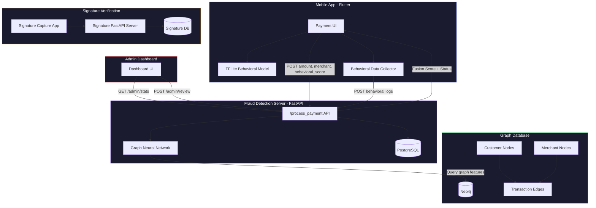

<div align="center">

# Beyond Rules

### Adaptive Fraud Detection for Banks

*A multi-layered AI system combining Graph Neural Networks, on-device behavioral biometrics, and signature verification to detect banking fraud in real-time.*

[](LICENSE)
[](https://flutter.dev)
[](https://fastapi.tiangolo.com)
[](https://pytorch.org)
[](https://neo4j.com)

**Team FunctionOverload** — UCO Bank Hackathon

[Architecture](#architecture) · [Components](#components) · [Setup](#setup) · [API Reference](#api-reference) · [Presentation](docs/Beyond_Rules_Presentation_v4.pdf)

</div>

---

## Problem Statement

Traditional rule-based fraud detection systems in banks suffer from:
- **High false positive rates** — blocking legitimate transactions and frustrating customers
- **Static thresholds** — unable to adapt to evolving fraud patterns
- **Siloed analysis** — ignoring relationships between entities (customers, merchants, transactions)
- **No behavioral context** — treating every transaction identically regardless of user behavior

## Our Solution

**Beyond Rules** replaces rigid rule engines with a **multi-layered AI fusion approach** that analyses transactions at three levels simultaneously:

| Layer | Model | Runs On | Purpose |
|-------|-------|---------|---------|
| **Layer 1** | TFLite Behavioral Model | On-Device | Detects anomalous user interaction patterns (tap speed, swipe behavior, screen dwell times) |
| **Layer 2** | Graph Neural Network (GNN) | Server | Analyzes transaction graph topology via Neo4j to find suspicious patterns across customer-merchant relationships |
| **Layer 3** | Fusion Scoring + Human Review | Both | Averages Layer 1 & Layer 2 scores; flags high-risk transactions for admin review |

### Key Innovation: Fusion Score

```
Fusion Score = (GNN Fraud Probability + Behavioral Anomaly Score) / 2

If Fusion Score ≥ 0.40 → Transaction flagged as "Pending" for admin review
If Fusion Score < 0.40  → Transaction auto-approved as "Paid"
```

This **dual-validation approach** significantly reduces false positives while catching sophisticated fraud that either model alone might miss.

---

## Architecture



### Transaction Flow

1. **User initiates payment** in the mobile app
2. **On-device TFLite model** generates a behavioral anomaly score from session biometrics (tap patterns, swipe speed, screen dwell times, typing latency)
3. **Request sent to server** with `{customer_id, merchant_id, amount, behavioral_score}`
4. **GNN queries Neo4j** for the customer-merchant subgraph and computes a graph-based fraud probability
5. **Fusion score** is computed: `(gnn_score + behavioral_score) / 2`
6. If score ≥ 0.40 → status = `"pending"` (flagged for admin review)  
   If score < 0.40 → status = `"paid"` (auto-approved)
7. **Transaction logged** in PostgreSQL with full audit trail
8. **Admin reviews** flagged transactions via the dashboard → approves or rejects
9. If approved → user gets notified to confirm → status becomes `"paid"`  
   If rejected → status becomes `"fraud"`

---

## Components

### `/mobile-app` — Flutter Payment Application

The primary banking interface built with Flutter. Features:
- **Modern dark-themed UI** with card management, transaction history, and statistics
- **On-device TFLite inference** — runs a trained behavioral biometrics model directly on the phone
- **Real-time behavioral data collection** — captures tap durations, swipe speeds/angles, screen transitions, and typing latency as a feature vector
- **Configurable server connection** — supports dynamic IP/port configuration
- **Transaction processing** with visual fraud score feedback

**Tech:** Flutter 3.8+, TFLite Flutter, Provider, fl_chart, HTTP

---

### `/fraud-detection-server` — Backend API

The FastAPI backend that orchestrates fraud detection:

#### `/fraud-detection-server/gnn-server` — GNN Fraud Detection (Primary)

The main production server using a **Graph Attention Network (GAT)** trained on the BankSim dataset:
- **Neo4j integration** — stores customer-merchant-transaction graph; queries subgraph features for each prediction
- **Heterogeneous GNN** — uses `HeteroGraphConv` with `GATConv` layers across customer, merchant, and transaction node types
- **PostgreSQL** — stores transaction logs, customer balances, and behavioral data
- **Admin endpoints** — `/admin/stats`, `/admin/pending_transactions`, `/admin/review_transaction`
- **Customer management** — balance tracking, top-ups, transaction statistics
- **Behavioral logging** — receives and stores behavioral biometrics from the mobile app

**Tech:** FastAPI, PyTorch, DGL, Neo4j, PostgreSQL, scikit-learn

#### `/fraud-detection-server/app.py` — XGBoost Baseline (Legacy)

The original v1 server using an XGBoost classifier for comparison. Kept for reference.

---

### `/signature-verification` — Signature Biometrics System

A standalone Flutter + FastAPI system for capturing and analyzing handwritten signatures:
- **Advanced signature capture** with pressure sensitivity, velocity tracking, and acceleration measurement
- **Rich feature extraction** — temporal, spatial, and dynamic features per stroke and per point
- **PostgreSQL storage** with ML-ready schema and analysis views
- **Data export** for training signature verification models
- **Docker support** for easy deployment

**Tech:** Flutter, FastAPI, PostgreSQL, Docker

---

### `/admin-dashboard` — Bank Admin Panel

A static web dashboard for bank administrators to review AI-flagged transactions:
- **Overview stats** — total volume, successful transactions, pending reviews, fraud rate
- **Pending reviews** — approve/reject transactions with one click
- **Transaction logs** — filterable history of all processed transactions
- **Analytics** — fraud trends, category breakdown, score distribution, model comparison charts
- **Live API connection** — optional toggle to connect to a running FastAPI server

**Tech:** HTML, CSS, JavaScript, Chart.js

> *Currently a static mock dashboard. Enter the FastAPI server URL in the sidebar to switch to live mode.*

---

### `/notebooks` — Training Notebooks

| Notebook | Description |
|----------|-------------|
| `GNN_Training.ipynb` | Trains the Graph Attention Network on the BankSim dataset using DGL and PyTorch |
| `Behavioral_Model.ipynb` | Trains the on-device behavioral biometrics model, exported as TFLite |
| `XGBoost_Baseline.ipynb` | Original XGBoost-based fraud classifier for baseline comparison |

---

## Setup

> **Important Configuration Note**: The placeholder `<YOUR_SERVER_IP>` is used in the Flutter client code (e.g., `settings_service.dart` and `signature_api_service.dart`) as well as the test notebooks. Before running the mobile app, signature app, or test notebooks, make sure to replace `<YOUR_SERVER_IP>` with the actual IP address of the machine hosting your FastAPI servers.

### Prerequisites

- **Flutter** 3.8+ ([install](https://docs.flutter.dev/get-started/install))
- **Python** 3.10+ 
- **PostgreSQL** 15+
- **Neo4j** 5.x ([download](https://neo4j.com/download/))
- **CUDA** (optional, for GPU-accelerated GNN training)

### 1. Clone the Repository

```bash
git clone https://github.com/<ConsoleCzar-2>/Beyond_Rules.git
cd Beyond_Rules
```

### 2. Set Up the GNN Server

```bash
cd fraud-detection-server/gnn-server

# Create and activate virtual environment
python -m venv venv
# Windows:
venv\Scripts\activate
# Linux/macOS:
source venv/bin/activate

# Install dependencies
pip install -r requirements.txt

# Configure environment
cp .env.example .env
# Edit .env with your Neo4j and PostgreSQL credentials

# Set up PostgreSQL database
psql -U postgres -c "CREATE DATABASE logdb;"
# Run the schema (see database_setup.sql in signature-verification/fastapi_server/)

# Start the server
python app2.py
```

The GNN server will start on `http://localhost:8000`.

### 3. Set Up the Mobile App

```bash
cd mobile-app

# Get Flutter dependencies
flutter pub get

# Run on connected device or emulator
flutter run
```

Configure the server IP in the app's Settings page.

### 4. Set Up Signature Verification (Optional)

```bash
cd signature-verification/fastapi_server

# Install dependencies
pip install -r requirements.txt

# Start the signature server
python main.py
```

Then run the Flutter signature app:
```bash
cd signature-verification
flutter pub get
flutter run
```

### 5. Open the Admin Dashboard

Simply open `admin-dashboard/index.html` in a browser. No build step required.

To connect to the live API, enter `http://localhost:8000` in the sidebar input.

---

## API Reference

### Core Endpoints (GNN Server)

| Method | Endpoint | Description |
|--------|----------|-------------|
| `POST` | `/process_payment` | Process a payment with fraud detection |
| `GET` | `/health` | Server health check |
| `GET` | `/admin/stats` | Dashboard statistics |
| `GET` | `/admin/pending_transactions` | List flagged transactions |
| `POST` | `/admin/review_transaction` | Approve or reject a transaction |
| `POST` | `/transactions/user_action` | User confirms or cancels a flagged transaction |
| `GET` | `/transactions/logs/{customer_id}` | Transaction history for a customer |
| `POST` | `/behavioral/log` | Store behavioral biometrics data |
| `GET` | `/customers/{customer_id}` | Customer details and balance |
| `POST` | `/customers/{customer_id}/balance` | Update customer balance |
| `GET` | `/customers/{customer_id}/stats` | Customer transaction statistics |

### Example: Process Payment

```bash
curl -X POST http://localhost:8000/process_payment \
  -H "Content-Type: application/json" \
  -d '{
    "customer_id": "C1234",
    "merchant_id": "M348934600",
    "amount": 25000.0,
    "tflite_score": 0.85
  }'
```

**Response:**
```json
{
  "id": "a1b2c3d4-...",
  "customer_id": "C1234",
  "merchant_id": "M348934600",
  "merch_category": "es_transportation",
  "amount": 25000.0,
  "fraud_probability": 0.62,
  "status": "pending",
  "timestamp": "2026-08-10T14:23:00"
}
```

---

## Datasets

This project uses the **BankSim** synthetic banking dataset for training:

| Dataset | Description | Download |
|---------|-------------|----------|
| `BankSim-Updated-Processed_new.csv` | Processed BankSim with engineered features | [Google Drive Link](https://drive.google.com/file/d/12B9ACHJI-DSla2gGpUc4dEP4kKDKBTr-/view?usp=sharing) |
| `BankSim-Updated.csv` | Intermediate processed version | [Google Drive Link](https://drive.google.com/file/d/1MQ9y0IsRg3vvgghHVW4ng5u3tWgrPafD/view?usp=sharing) |
| `bs140513_032310.csv` | Original BankSim dataset | [Google Drive Link](https://drive.google.com/file/d/17S4nJBH91wdIKDCP4OelC-axUJ59nFr5/view?usp=sharing) |

> The CSV files are excluded from the repository due to size constraints. Download them from the links above and place them in the appropriate directories.

---

## Team

**Team FunctionOverload** — Indian Institute of Engineering Science and Technology, Shibpur

| Name | Role |
|------|------|
| **Abhirup Saha** | Team Lead, Architecture, Signature Verification |
| **Pritam Bag** | Mobile App Development, Demo, System Integration |
| **Swarnava Banerjee** | ML Engineering |
| **Yasharth Shukla** | Admin Dashboard, Analytics |

---

## Documentation

- [Final Presentation (v4 PDF)](docs/Beyond_Rules_Presentation_v4.pdf)
- [Architecture Details](docs/architecture.md)

---

## License

This project is licensed under the **MIT License** — see the [LICENSE](LICENSE) file for details.

---

<div align="center">

*Built for the UCO Bank Hackathon, 2025*

</div>