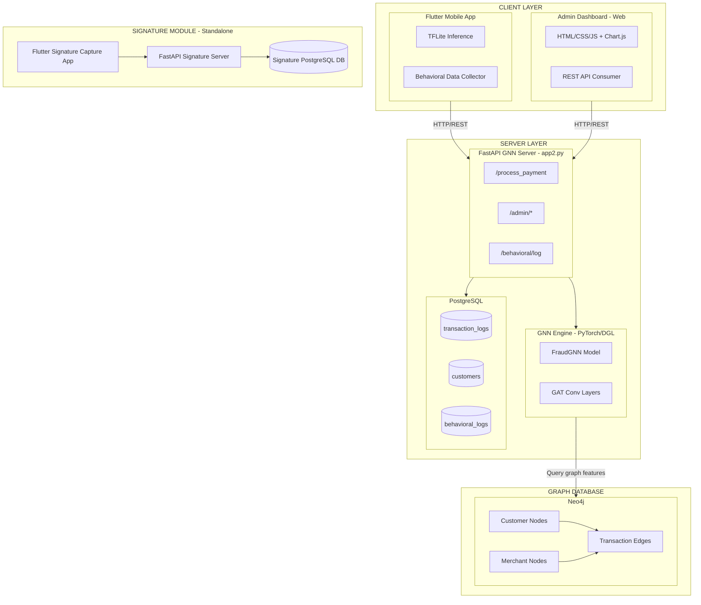
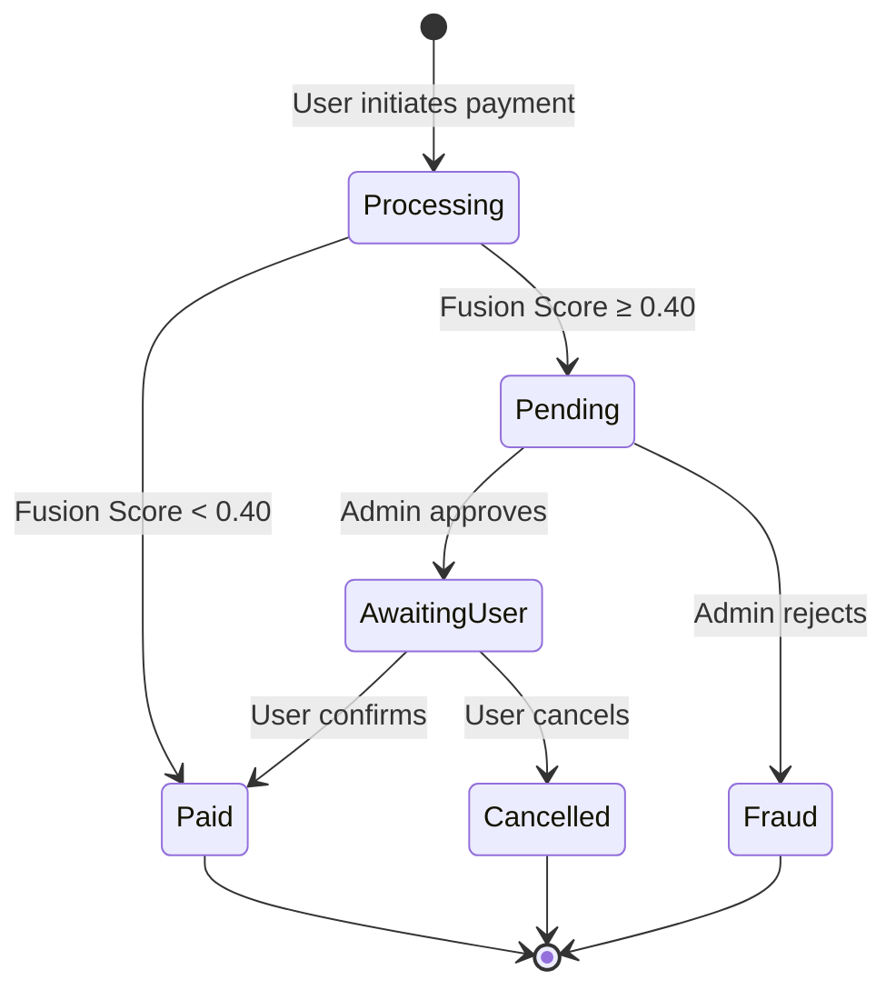

# System Architecture — Beyond Rules

This document provides a deeper technical look at each component of the Beyond Rules fraud detection system.

---

## Technology Stack Overview



---

## ML Models

### 1. Graph Neural Network (GNN)

- **Architecture:** `FraudGNN` — a heterogeneous graph neural network
  - 3 layers of `HeteroGraphConv` with `GATConv` (Graph Attention)
  - 2 attention heads, 64 hidden dimensions
  - Layer normalization + residual connections
  - Dropout 0.2
  - Binary classification head (fraud / not-fraud)

- **Graph Schema (Neo4j):**
  - **Node types:** `Customer`, `Merchant`, `Transaction`
  - **Edge types:**
    - `Customer --MAKES--> Transaction`
    - `Merchant --RECEIVES--> Transaction`
    - (Reverse edges for message passing)

- **Input Features:**
  - Customer: `[txn_count, avg_amount]` — scaled via `StandardScaler`
  - Merchant: `[txn_count, avg_amount, fraud_rate]` — scaled
  - Transaction: `[amount]` — scaled

- **Inference:** For each payment, a single-node heterogeneous graph is constructed, features are scaled using pre-fitted scalers, and a forward pass through the trained model yields a fraud probability via softmax.

- **Training:** See `notebooks/GNN_Training.ipynb` — trained on the BankSim dataset with ~600K transactions.

### 2. On-Device Behavioral Model (TFLite)

- **Architecture:** Neural network exported to TensorFlow Lite
- **Runs on:** Mobile device (no network latency)
- **Input features (10-dim vector):**
  1. `time_since_last_transaction` (seconds)
  2. `current_amount`
  3. `historical_average_amount`
  4. `transaction_frequency`
  5. `hour_of_day`
  6. `day_of_week`
  7. `is_weekend`
  8. `is_night`
  9. `country_mismatch`
  10. `transaction_type`

- **Preprocessing:** StandardScaler applied on-device using hardcoded mean/scale values from training
- **Output:** Sigmoid probability (0 = safe, 1 = fraud)
- **Training:** See `notebooks/Behavioral_Model.ipynb`

### 3. Behavioral Biometrics Collector

Not a model itself, but a real-time feature extractor running in the Flutter app that captures:

| Feature | Description |
|---------|-------------|
| Tap Duration Avg | Average milliseconds per tap |
| Tap Interval Avg | Average time between consecutive taps |
| Swipe Speed Avg | Average pixels-per-millisecond of swipes |
| Swipe Angle Variance | Variance in swipe directions |
| Tap X Position Mean | Horizontal tap position tendency |
| Swipe X Direction Avg | Predominant swipe direction |
| Screen Dwell Times | Time spent on each screen (home, payment, etc.) |
| Screen Transition Rate | Navigation speed (transitions/minute) |
| Typing Latency Avg | Average inter-keystroke interval |

These features are sent to the server via `POST /behavioral/log` for storage and potential model retraining.

---

## Database Schema

### PostgreSQL — Transaction Database (`logdb`)

```sql
-- Core transaction log
CREATE TABLE transaction_logs (
    id UUID PRIMARY KEY,
    customer_id VARCHAR,
    merchant_id VARCHAR,
    merch_category VARCHAR,
    amount FLOAT,
    fraud_probability FLOAT,
    status VARCHAR,  -- 'paid', 'pending', 'fraud', 'cancelled', 'awaiting-user-confirmation'
    timestamp TIMESTAMP
);

-- Customer balance tracking
CREATE TABLE customers (
    id VARCHAR PRIMARY KEY,
    name VARCHAR,
    balance FLOAT DEFAULT 10000.0,
    created_at TIMESTAMP,
    updated_at TIMESTAMP
);

-- Behavioral biometrics log
CREATE TABLE behavioral_logs (
    id VARCHAR PRIMARY KEY,
    customer_id VARCHAR,
    transaction_id VARCHAR,
    session_id VARCHAR,
    behavioral_features JSONB,
    screen_dwell_times JSONB,
    total_taps INTEGER,
    total_swipes INTEGER,
    screen_transitions INTEGER,
    session_duration FLOAT,
    timestamp TIMESTAMP
);
```

### PostgreSQL — Signature Database

```sql
CREATE TABLE signatures (
    id VARCHAR(255) PRIMARY KEY,
    created_at TIMESTAMP,
    canvas_width FLOAT,
    canvas_height FLOAT,
    device_info JSONB,
    metadata JSONB,
    strokes JSONB,
    total_duration FLOAT,
    total_strokes INTEGER,
    total_points INTEGER,
    average_stroke_speed FLOAT,
    average_pressure FLOAT,
    signature_width FLOAT,
    signature_height FLOAT,
    stroke_density FLOAT
);

CREATE TABLE signature_points (
    id SERIAL PRIMARY KEY,
    signature_id VARCHAR(255) REFERENCES signatures(id),
    stroke_index INTEGER,
    point_index INTEGER,
    x FLOAT, y FLOAT,
    pressure FLOAT,
    timestamp TIMESTAMP,
    velocity FLOAT,
    acceleration FLOAT
);
```

---

## Fraud Detection Workflow States



---

## Future Enhancements

- **Federated learning** — train personalized behavioral models on each device without sending raw biometric data to the server
- **Real-time signature verification** — compare live signatures against stored baselines using Siamese networks
- **CAPTCHA integration** — additional verification layer for high-risk transactions
- **Model versioning** — push updated TFLite models to devices when global model improves (see `docs/` workflow notes)
